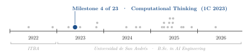
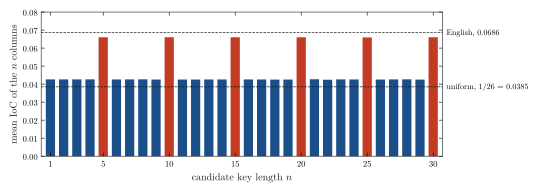
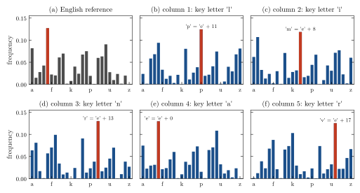

<div align="center">

# Breaking the Vigenère Cipher with the Index of Coincidence

**Santiago Groba Alonso** · [Felipe Viaggio](https://github.com/FelipeViaggio)

Universidad de San Andrés · *Computational Thinking* · First semester 2023 · Assignment 2

[](#reproducing-the-results)
[](#reproducing-the-results)
[](LICENSE.md)

<picture>
  <source media="(prefers-color-scheme: dark)" srcset="docs/figures/trajectory-dark.svg">
  
</picture>

</div>

> **Abstract.** We implement the Vigenère cipher in plain Python (an encryptor and a decryptor) and a tool that recovers the key of a ciphertext without knowing it. The attack has two stages: the Friedman test finds the key length by splitting the text into $n$ interleaved columns and measuring their index of coincidence (IoC), and frequency analysis then reads each key letter off the shift of the letter *e* in its column. On the 13,931-letter ciphertext in `encrypted.txt`, the mean column IoC jumps from 0.043 (close to the 0.038 of uniform text) to 0.066 (close to English, 0.069) exactly at multiples of 5; the five columns then give the key `linar`, which decrypts the file into readable English. The whole attack uses only letter counts, which is why a short repeating key offers no real protection on a long text.

---

## 1. Problem

The Vigenère cipher shifts the $i$-th letter of the message by the $(i \bmod n)$-th letter of a key of length $n$:

$$c_i = (p_i + k_{i \bmod n}) \bmod 26, \qquad p_i = (c_i - k_{i \bmod n}) \bmod 26 .$$

The assignment consists of three programs: one that encrypts a text file with a user-supplied key, one that decrypts it, and one that helps break an encrypted file by (1) estimating the key length with the index of coincidence and (2) running frequency analysis on each position of the key, with plots to guide the user.

## 2. Methods

| Component | Choice |
|---|---|
| Alphabet | the 26 English letters; text is lower-cased and every other character is passed through unchanged (and does not consume a key letter) |
| Index of coincidence | $\mathrm{IoC} = \sum_{c} f_c(f_c - 1) \,/\, N(N-1)$, with $f_c$ the count of letter $c$ in a text of $N$ letters |
| Key length (Friedman test) | for each $n = 1, \dots, 30$, split the letters into $n$ columns $\{x_j, x_{j+n}, x_{j+2n}, \dots\}$ and average their IoC; a column encrypted with a single shift keeps the IoC of English |
| Key letters | in each column, take the most frequent letter and assume it is the image of *e* (`forzar_clave`) |
| References | English IoC 0.0686 and uniform IoC $1/26 = 0.0385$; English letter frequencies from a standard table |
| Interface | interactive prompts with validation of file paths, permissions and key characters; plots with Matplotlib |

## 3. Results

All numbers below come from running the repository's own functions on `encrypted.txt` in this session (`docs/figures/make_figures.py`).

<p align="center"></p>

**Figure 1.** Friedman test. Mean IoC of the $n$ columns for each candidate key length. For $n$ not a multiple of the key length, each column mixes five Caesar shifts and looks almost uniform (0.043); at $n = 5, 10, \dots, 30$ every column uses a single shift and the IoC rises to 0.066, close to the English reference. The shortest peak, $n = 5$, is the key length.

<p align="center"></p>

**Figure 2.** Frequency analysis with key length 5. (a) English letter frequencies, with *e* highlighted. (b)–(f) Letter frequencies in each column of the ciphertext; the profile is the English one rotated, and the shift of the highlighted peak from *e* is the key letter.

**Table 1.** Per-column statistics for key length 5.

| Column | Letters | Most frequent letter (share) | Shift from *e* | Key letter | Column IoC |
|---:|---:|---|---:|:---:|---:|
| 1 | 2,787 | *p* (12.5 %) | 11 | `l` | 0.0652 |
| 2 | 2,786 | *m* (11.8 %) | 8 | `i` | 0.0639 |
| 3 | 2,786 | *r* (13.0 %) | 13 | `n` | 0.0681 |
| 4 | 2,786 | *e* (13.0 %) | 0 | `a` | 0.0657 |
| 5 | 2,786 | *v* (12.5 %) | 17 | `r` | 0.0671 |

The recovered key `linar` decrypts the file into an English essay of study advice for undergraduates, and encrypting that plaintext again with `encryptor.py` reproduces `encrypted.txt` exactly. The IoC of the whole ciphertext is 0.0426.

## 4. Takeaways

- Two cheap statistics, the IoC and a frequency peak, break a polyalphabetic cipher when the text is long compared to the key: here each column still has about 2,800 letters, so the *e* peak is unmistakable.
- Taking the shortest length among the IoC peaks matters: every multiple of the true length scores just as well.
- Writing the attack as small, documented functions (`text_divisor`, `calculo_ioc`, `forzar_clave`) made it possible to reuse them unchanged for the figures in this README.

## Reproducing the results

```bash
pip install matplotlib
python key_brute_forcing.py      # file: encrypted.txt, then key length: 5
                                 # -> Una posible clave utilizada es 'linar'
python decryptor.py              # file, key and output path are asked interactively
python encryptor.py
python docs/figures/make_figures.py   # Figures 1-2 and the numbers in Table 1
```

| File | Content |
|---|---|
| `encryptor.py` | `cifrado_vi(texto, clave)` and an interactive front end that writes the encrypted file |
| `decryptor.py` | `descifrado_vi(texto, clave)` and its interactive front end |
| `key_brute_forcing.py` | Friedman test, frequency analysis and key guess, with the original Matplotlib plots |
| `encrypted.txt` | Ciphertext analysed in this README |
| `Images/` | Screenshots of the original plots (IoC and per-column frequencies) |
| `docs/figures/` | Script and style used for the figures in this README |

## Citation

```bibtex
@misc{groba2023vigenere,
  author       = {Groba Alonso, Santiago and Viaggio, Felipe},
  title        = {Breaking the Vigen{\`e}re Cipher with the Index of Coincidence},
  year         = {2023},
  howpublished = {Universidad de San Andr{\'e}s, Computational Thinking},
  url          = {https://github.com/Santi2065/Vigenere-Cipher}
}
```
